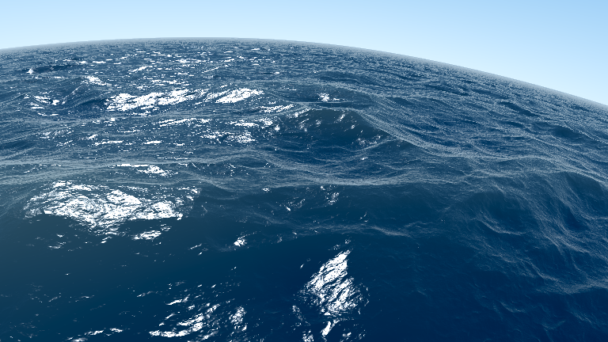
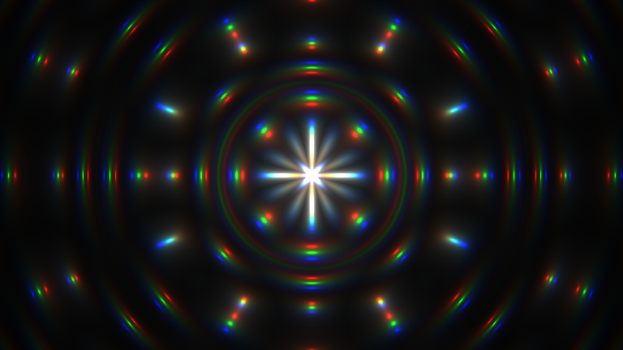
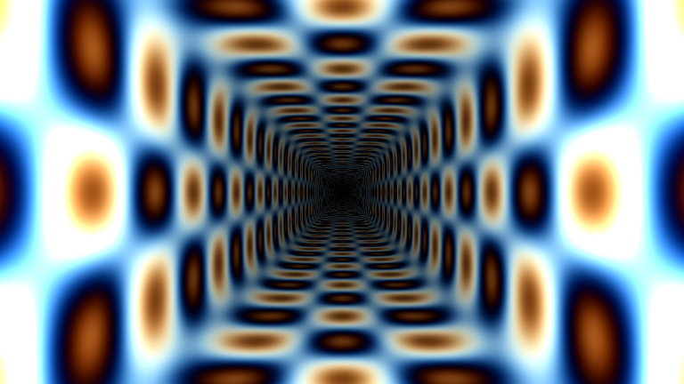

# SOFT SHADER

Softshader obtains a 32 bit pointer to video memory using SDL2
and emulates popular Shadertoy shaders multithreaded entirely in software using C++17.

## Building

    sudo pacman -S sdl2 # or, eg. sudo apt-get intall libsdl2-dev
    make -C src

Then, run a shader of your choice.

    ./seascape

    ./creation

    ./tunnel

